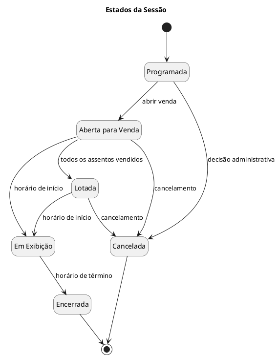

# Crítica de Boteco

> Sistema de cinema voltado à documentação acadêmica de Projeto de Software, com modelagem UML em PlantUML e proposta temática inspirada em críticas informais de boteco.

---

## Status do Projeto


---

## Índice

- [Sobre o Projeto](#sobre-o-projeto)
- [Objetivo](#objetivo)
- [Funcionalidades Documentadas](#funcionalidades-documentadas)
- [Tecnologias e Ferramentas Utilizadas](#tecnologias-e-ferramentas-utilizadas)
- [Modelagem do Sistema](#modelagem-do-sistema)
- [Casos de Uso](#casos-de-uso)
- [Diagramas](#diagramas)
- [Estrutura Sugerida do Repositório](#estrutura-sugerida-do-repositório)
- [Como Visualizar os Diagramas](#como-visualizar-os-diagramas)
- [Autor](#autor)
- [Licença](#licença)

---

## Sobre o Projeto

O **Crítica de Boteco** é um sistema de cinema desenvolvido como proposta acadêmica para a disciplina de **Projeto de Software**.

A ideia do sistema é oferecer uma plataforma para gerenciamento de filmes, sessões, salas, assentos, usuários, compras de ingressos, pagamentos, avaliações, comentários, denúncias e moderação de conteúdo. O nome **Crítica de Boteco** representa uma proposta temática descontraída, inspirada em comentários informais sobre filmes, como se os usuários estivessem debatendo cinema em uma conversa de boteco.

O projeto não representa, neste momento, uma aplicação implementada em linguagem de programação específica. Seu foco principal está na **documentação, análise, modelagem e projeto de software**, utilizando diagramas UML descritos em **PlantUML**.

---

## Objetivo

O objetivo deste projeto é documentar e modelar um sistema de cinema de forma estruturada, clara e acadêmica, contemplando requisitos, atores, casos de uso, arquitetura conceitual, modelos de projeto, modelos de dados e diagramas UML.

A documentação busca demonstrar a compreensão dos principais elementos de um projeto de software, incluindo:

- identificação dos atores do sistema;
- definição dos requisitos funcionais;
- descrição dos casos de uso;
- representação da arquitetura do sistema;
- modelagem das classes do domínio;
- representação dos fluxos por diagramas de sequência;
- modelagem de estados;
- representação do modelo de dados;
- uso de PlantUML para criação dos diagramas.

---

## Funcionalidades Documentadas

O sistema **Crítica de Boteco** contempla, em sua documentação, as seguintes funcionalidades:

- cadastro de usuários;
- autenticação de usuários;
- consulta de filmes em cartaz;
- visualização dos detalhes de filmes;
- consulta de sessões disponíveis;
- escolha de assentos;
- compra de ingressos;
- realização de pagamento;
- cancelamento de compra;
- emissão de ingresso digital;
- avaliação de filmes;
- publicação de comentários;
- denúncia de comentários;
- moderação de avaliações e comentários;
- gerenciamento de filmes;
- gerenciamento de salas;
- gerenciamento de sessões;
- gerenciamento de promoções e cupons;
- geração de relatórios de vendas;
- gerenciamento de usuários.

---

## Tecnologias e Ferramentas Utilizadas

Este projeto utiliza apenas recursos relacionados à documentação e modelagem.

| Tecnologia/Ferramenta | Finalidade |
| :--- | :--- |
| **Markdown** | Escrita e organização deste README. |
| **PlantUML** | Criação dos diagramas UML do sistema. |

> Nenhuma linguagem de programação, framework, banco de dados, biblioteca de front-end, back-end ou ferramenta de deploy foi considerada como tecnologia utilizada, pois não foi informada uma implementação do sistema.

---

## Modelagem do Sistema

A modelagem do sistema foi organizada com base em conceitos de Projeto de Software e UML.

A documentação contempla:

- modelo de atores;
- modelo de casos de uso;
- diagramas de casos de uso;
- diagramas de sequência do sistema;
- contratos de operação;
- arquitetura conceitual em camadas;
- diagrama de componentes;
- diagrama de implantação;
- diagrama de classes;
- diagramas de sequência de projeto;
- diagramas de comunicação;
- diagramas de estados;
- modelo de dados relacional;
- histórico de revisões.

---

## Casos de Uso

A documentação do projeto apresenta 20 casos de uso, numerados de **UC-01** até **UC-20**.

| ID | Caso de Uso |
| :--- | :--- |
| UC-01 | Cadastrar usuário |
| UC-02 | Realizar login |
| UC-03 | Consultar filmes em cartaz |
| UC-04 | Visualizar detalhes do filme |
| UC-05 | Consultar sessões disponíveis |
| UC-06 | Escolher assentos |
| UC-07 | Comprar ingresso |
| UC-08 | Realizar pagamento |
| UC-09 | Cancelar compra |
| UC-10 | Emitir ingresso digital |
| UC-11 | Avaliar filme |
| UC-12 | Comentar filme |
| UC-13 | Denunciar comentário |
| UC-14 | Moderar avaliações e comentários |
| UC-15 | Gerenciar filmes |
| UC-16 | Gerenciar salas |
| UC-17 | Gerenciar sessões |
| UC-18 | Gerenciar promoções e cupons |
| UC-19 | Gerar relatório de vendas |
| UC-20 | Gerenciar usuários |

---

## Diagramas

Os diagramas do projeto são escritos em **PlantUML**.

A documentação contempla os seguintes diagramas:

- diagrama de casos de uso;
- diagramas de sequência do sistema;
- diagrama de arquitetura;
- diagrama de componentes;
- diagrama de implantação;
- diagrama de classes;
- diagramas de sequência de projeto;
- diagramas de comunicação;
- diagramas de estados;
- diagrama entidade-relacionamento ou diagrama de banco de dados.

Exemplo de diagrama de estados em PlantUML:



---

## Estrutura Sugerida do Repositório

A estrutura abaixo é sugerida apenas para organização dos arquivos de documentação e diagramas.

```text
.
├── README.md
├── documentacao/
│   └── Documentacao_de_Projeto_Critica_de_Boteco.docx
├── diagramas/
│   ├── casos-de-uso.puml
│   ├── sequencia-comprar-ingresso.puml
│   ├── sequencia-realizar-pagamento.puml
│   ├── sequencia-avaliar-filme.puml
│   ├── arquitetura.puml
│   ├── componentes.puml
│   ├── implantacao.puml
│   ├── classes.puml
│   ├── comunicacao-comprar-ingresso.puml
│   ├── comunicacao-avaliar-filme.puml
│   ├── comunicacao-gerenciar-filmes.puml
│   ├── estados-compra.puml
│   ├── estados-ingresso.puml
│   ├── estados-sessao.puml
│   └── banco-de-dados.puml
└── imagens/
    └── diagramas-renderizados/
```

---

## Como Visualizar os Diagramas

Os diagramas podem ser visualizados por meio de qualquer ferramenta compatível com **PlantUML**.

Opções possíveis:

- extensão PlantUML em editores de texto compatíveis;
- servidor local PlantUML;
- renderizadores online compatíveis com PlantUML;
- exportação dos arquivos `.puml` para imagens em formato `.png` ou `.svg`.

Cada diagrama deve começar com `@startuml` e terminar com `@enduml`.

---

## Autor

| Nome | E-mail |
| :--- | :--- |
| Eddie Christian Pereira | 1378031@sga.pucminas.br |

---

## Licença

Este projeto foi elaborado para fins acadêmicos.
